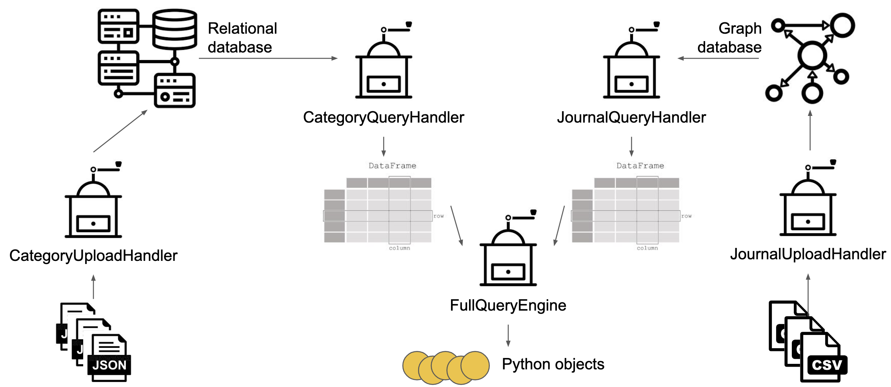
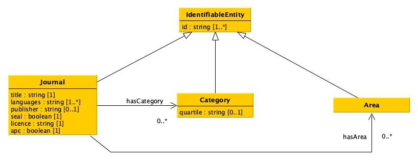

# Git-Lost
**Hello! This is a project for our [Data Science Exam](https://github.com/comp-data/2024-2025).**
# 📊 Data Science Project

This project aims to develop a software to process data stored in different formats (CSV and JSON) and upload them into two distinct databases (a graph database and a relational database). The software also provides tools to query both databases simultaneously through predefined operations.

---

## 📁 Data

We provide exemplar data to test the project:
- [`data/doaj.csv`](data/doaj.csv): metadata about journals from the [Directory of Open Access Journals (DOAJ)](https://doaj.org). Note: multiple languages of the same journal are stored in a single string separated by `, `.
- [`data/scimago.json`](data/scimago.json): data from [Scimago Journal Rank](https://www.scimagojr.com), including identifiers (ISSNs), categories, and areas.

> ⚠️ Any custom CSV/JSON file used must respect the same structure as these exemplars.

---

## 🛠️ Workflow



---

## 🧩 Data Model



All classes must implement the *get* and *has* methods as shown in the UML diagrams. Additional methods are allowed, but constructors and methods listed below are mandatory.

---

## 📦 Classes

### Handler
| Attribute          | Description                                                       |
|------------------|-------------------------------------------------------------------|
| `dbPathOrUrl`    | Path or URL of the database, initially empty |

| Method              | Description                                       |
|---------------------|--------------------------------------------------|
| `getDbPathOrUrl()`  | Returns the current database path/URL           |
| `setDbPathOrUrl()`  | Sets a new database path/URL                    |

---

### UploadHandler (abstract)
| Method              | Description                                       |
|---------------------|--------------------------------------------------|
| `pushDataToDb()`    | Uploads data from input file to the database     |

Subclasses implement specific logic:

- `JournalUploadHandler`: handles CSV data → graph database
- `CategoryUploadHandler`: handles JSON data → relational database

---

### QueryHandler (abstract)
| Method                | Description                                                         |
|----------------------|----------------------------------------------------------------------|
| `getById(id)`        | Returns data frame with entity matching input ID                      |

---

### JournalQueryHandler
| Method                          | Description                                       |
|---------------------------------|--------------------------------------------------|
| `getAllJournals()`             | All journals                                     |
| `getJournalsWithTitle(title)`  | Journals whose title matches input string        |
| `getJournalsPublishedBy(pub)`  | Journals whose publisher matches input string    |
| `getJournalsWithLicense(lic)`  | Journals with specified license                  |
| `getJournalsWithAPC()`        | Journals with Article Processing Charges         |
| `getJournalsWithDOAJSeal()`   | Journals with DOAJ Seal                          |

---

### CategoryQueryHandler
| Method                                    | Description                                                                   |
|-------------------------------------------|------------------------------------------------------------------------------|
| `getAllCategories()`                      | All categories, no repetitions                                               |
| `getAllAreas()`                           | All areas, no repetitions                                                    |
| `getCategoriesWithQuartile(quartiles)`   | Categories in specified quartiles                                            |
| `getCategoriesAssignedToAreas(areas)`    | Categories assigned to specified areas                                       |
| `getAreasAssignedToCategories(categories)`| Areas assigned to specified categories                                       |

---

### BasicQueryEngine
Handles combined queries across multiple query handlers.

| Attribute         | Description                                    |
|------------------|-----------------------------------------------|
| `journalQuery`   | List of `JournalQueryHandler` objects        |
| `categoryQuery`  | List of `CategoryQueryHandler` objects       |

| Method                                 | Description                                                       |
|----------------------------------------|------------------------------------------------------------------|
| `cleanJournalHandlers()`              | Clears list of journal handlers                                 |
| `cleanCategoryHandlers()`             | Clears list of category handlers                                |
| `addJournalHandler(handler)`          | Adds a new journal handler                                      |
| `addCategoryHandler(handler)`         | Adds a new category handler                                     |
| `getEntityById(id)`                   | Returns entity (journal/category/area) matching the ID          |
| `getAllJournals()`                    | All journals                                                    |
| `getJournalsWithTitle(title)`         | Journals with matching title                                   |
| `getJournalsPublishedBy(pub)`         | Journals with matching publisher                               |
| `getJournalsWithLicense(lic)`         | Journals with matching license                                 |
| `getJournalsWithAPC()`                | Journals with APC                                              |
| `getJournalsWithDOAJSeal()`           | Journals with DOAJ Seal                                        |
| `getAllCategories()`                   | All categories                                                 |
| `getAllAreas()`                        | All areas                                                      |
| `getCategoriesWithQuartile(quartiles)`| Categories with specified quartiles                            |
| `getCategoriesAssignedToAreas(areas)` | Categories assigned to areas                                   |
| `getAreasAssignedToCategories(categories)` | Areas assigned to categories                            |

---

### FullQueryEngine
Advanced mash-up queries combining both databases.

| Method                                                        | Description                                                                    |
|---------------------------------------------------------------|-------------------------------------------------------------------------------|
| `getJournalsInCategoriesWithQuartile(categories, quartiles)` | Journals in specified categories/quartiles                                    |
| `getJournalsInAreasWithLicense(areas, licenses)`            | Journals with specified license and areas                                     |
| `getDiamondJournalsInAreasAndCategoriesWithQuartile(categories, quartiles, areas)` | Journals with no APC, in specified areas and categories/quartiles |

---

## 🧪 Usage Example

```python
# Import classes
from impl import (
    CategoryUploadHandler, CategoryQueryHandler,
    JournalUploadHandler, JournalQueryHandler,
    FullQueryEngine
)

# Upload data to relational DB
rel_db = "relational.db"
cat_handler = CategoryUploadHandler()
cat_handler.setDbPathOrUrl(rel_db)
cat_handler.pushDataToDb("data/scimago.json")

# Upload data to graph DB (start Blazegraph first)
graph_endpoint = "http://127.0.0.1:9999/blazegraph/sparql"
jou_handler = JournalUploadHandler()
jou_handler.setDbPathOrUrl(graph_endpoint)
jou_handler.pushDataToDb("data/doaj.csv")

# Create query handlers
cat_qh = CategoryQueryHandler()
cat_qh.setDbPathOrUrl(rel_db)

jou_qh = JournalQueryHandler()
jou_qh.setDbPathOrUrl(graph_endpoint)

# Create mash-up query engine
engine = FullQueryEngine()
engine.addCategoryHandler(cat_qh)
engine.addJournalHandler(jou_qh)

# Example query
journals = engine.getJournalsInCategoriesWithQuartile(["Oncology"], ["Q1"])
print(journals)
```
## The Git-Lost Team 

☺ [Rumana](https://github.com/rumana-mh) <br/>
✦ [Nico](https://github.com/nichothenacho64) <br/>
♥ [Martina](https://github.com/martinamrc) <br/>
♪ [Ilaria](https://github.com/theair-hub)
